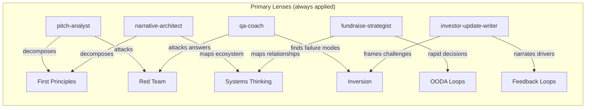
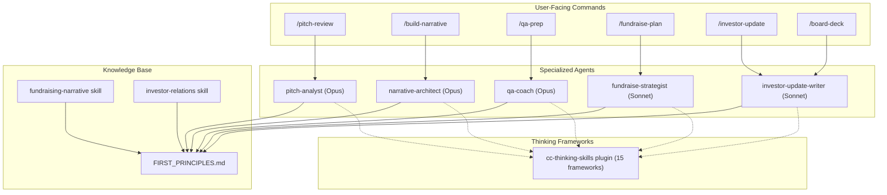

<p align="center">
  <h1 align="center">VC Fundraising Toolkit for Claude Code</h1>
</p>

<p align="center">
  <strong>AI-powered pitch analysis, fundraising strategy, and investor relations for startup founders -- grounded in first principles from Sequoia, a16z, Benchmark, and YC.</strong>
</p>

<p align="center">
  <a href="https://github.com/tjboudreaux/cc-skills-vc-fundraising/blob/main/LICENSE"></a>
  <a href="#agents"></a>
  <a href="#commands"></a>
  <a href="#thinking-skills-integration"></a>
</p>

---

## Why This Exists

Raising venture capital is a storytelling problem disguised as a finance problem. The best pitch decks don't just present data -- they construct a narrative so compelling that a VC partner can retell it in 30 seconds to their partnership and get heads nodding.

This plugin encodes the fundraising wisdom of Don Valentine, Ben Horowitz, Mike Maples Jr., Andy Rachleff, Paul Graham, Reid Hoffman, Peter Thiel, and Mark Suster into a set of specialized AI agents that help founders at every stage -- from crafting the initial narrative to preparing for tough Q&A to writing monthly investor updates.

> *"The money flows as a function of the story."* -- Don Valentine, Sequoia Capital

---

## Table of Contents

- [Quick Start](#quick-start)
- [Commands](#commands)
- [Agents](#agents)
- [Skills](#skills)
- [The 10 First Principles](#the-10-first-principles)
- [Thinking Skills Integration](#thinking-skills-integration)
- [Architecture](#architecture)
- [Prerequisites](#prerequisites)
- [Contributing](#contributing)
- [License](#license)

---

## Quick Start

```bash
# Clone and install
git clone https://github.com/tjboudreaux/cc-skills-vc-fundraising.git
claude plugin add /path/to/cc-skills-vc-fundraising
```

Then use any command directly in Claude Code:

```
/pitch-review We're building an AI-powered compliance platform for fintech...
/build-narrative Series A, $12M raise, B2B SaaS for healthcare...
/qa-prep Seed round, developer tools company, $4M ARR...
```

> [!TIP]
> Install the companion [Thinking Skills](https://github.com/tjboudreaux/cc-thinking-skills) plugin to unlock systems thinking, red-teaming, and 13 other analytical frameworks across all agents.

---

## Commands

Six one-command workflows for every stage of the fundraising journey.

| Command | What It Does |
|---------|-------------|
| **`/pitch-review`** | Scores your pitch across 11 dimensions (out of 55) with specific rewrites for weak sections |
| **`/build-narrative`** | Builds a complete Sequoia-format pitch narrative and 10-slide deck from a discovery interview |
| **`/qa-prep`** | Identifies the 10 toughest questions VCs will ask, coaches responses, and runs live simulation |
| **`/fundraise-plan`** | Creates a week-by-week fundraising playbook with readiness scorecard, target list strategy, and competitive dynamics plan |
| **`/investor-update`** | Drafts a monthly investor update in the 5-15 format (5 min to read, 15 min to write) |
| **`/board-deck`** | Structures a board meeting following Sequoia's 3-hour framework with SCQA deep dives |

<details>
<summary><strong>Example: /pitch-review output</strong></summary>

```
Overall Score: 38/55 (B+)

Dimension Scores:
  1. Narrative Coherence      4/5  Strong story arc, retellable
  2. Earned Secret            3/5  Insight is clear but origin story needs work
  3. "Why Now"                5/5  Concrete inflection point with data
  4. Value Hypothesis         4/5  Strong customer pull signals
  5. Customer as Hero         2/5  Too founder-centric -- reframe
  6. Market Size              4/5  Bottom-up is solid, expand TAM argument
  7. Clarity & Precision      3/5  Too many qualifiers ("very", "extremely")
  8. Traction Storytelling    5/5  Strong MoM growth with cohort data
  9. Internal Championing     3/5  Missing clear investment thesis on slide 1
  10. Conviction & Urgency    3/5  Strong conviction, weak urgency
  11. Stage Appropriateness   4/5  Well-matched to Series A

30-Second Retell:
"[Company] automates compliance for fintechs. Their insight is that
compliance teams spend 70% of time on repetitive checks that AI can
handle. They're at $2M ARR growing 25% month-over-month, and the
market shifted when [regulation] passed in January. Raising $15M to
expand into banking."

Top 3 Fixes:
1. Add investment thesis bullets to slide 1
2. Reframe slides 2-3 around customer transformation
3. Add process timeline to create urgency
```

</details>

---

## Agents

Five specialized agents, each with structured thinking frameworks woven into their analysis.

| Agent | Model | Purpose | Thinking Enhancements |
|-------|-------|---------|----------------------|
| **pitch-analyst** | Opus | Evaluates pitches across 11 scored dimensions with specific rewrites | First principles, red-team, inversion, steel-manning |
| **narrative-architect** | Opus | Constructs complete pitch narratives following Sequoia's arc | First principles, systems thinking, JTBD, feedback loops |
| **qa-coach** | Opus | Prepares founders for the 35 toughest VC questions | Red-team, inversion, pre-mortem, bayesian updating |
| **fundraise-strategist** | Sonnet | Plans end-to-end process from prep through close | Systems, theory of constraints, OODA, regret minimization |
| **investor-update-writer** | Sonnet | Drafts investor communications that build trust and momentum | Feedback loops, inversion, systems, second-order effects |

<details>
<summary><strong>What the pitch-analyst evaluates</strong></summary>

Every pitch is scored 1-5 across 11 dimensions:

1. **Narrative Coherence** -- Can it be retold in 30 seconds?
2. **Earned Secret Strength** -- Is the insight genuinely non-consensus and earned?
3. **"Why Now" Conviction** -- Is there a concrete inflection point?
4. **Value Hypothesis** -- Are there desperate customers with organic pull?
5. **Customer as Hero** -- Is the customer transformed, not just served?
6. **Market Size Credibility** -- Bottom-up + top-down, avoiding "1% of China"
7. **Clarity & Precision** -- Numbers replace adjectives, plain language throughout
8. **Traction Storytelling** -- MoM context, cohorts, qualitative + quantitative
9. **Internal Championing** -- Does it arm a VC partner for their IC meeting?
10. **Conviction & Urgency** -- Does it build belief AND a reason to act now?
11. **Stage Appropriateness** -- Does the narrative match Pre-Seed through Growth?

</details>

<details>
<summary><strong>What the qa-coach covers</strong></summary>

35 tough VC questions across 7 categories, with the Acknowledge-Bridge-Message (ABM) framework:

- **Market & Problem** -- "Why hasn't someone else built this?" "Is this a feature or a company?"
- **Product & Traction** -- "How do you know you have PMF?" "Your growth seems to have flattened."
- **Team & Execution** -- "Why are you the team to build this?" "Tell me about a time you were wrong."
- **Business Model** -- "Your burn seems high relative to revenue." "Why this valuation?"
- **Competition** -- "What's your moat?" "How defensible is this in 5 years?"
- **Strategy & Vision** -- "What's the biggest risk?" "What does this look like in 10 years?"
- **Conviction & Process** -- "Why will this be a $10B company?" "Who else are you talking to?"

Each response is red-teamed from the VC's perspective before finalizing.

</details>

---

## Skills

Two domain skills that auto-activate based on conversation context.

| Skill | Auto-Activates When You Mention |
|-------|-------------------------------|
| **fundraising-narrative** | pitch deck, fundraising story, VC narrative, earned secret, why now, TAM/SAM/SOM, value hypothesis, product-market fit |
| **investor-relations** | investor update, board deck, monthly update, crisis communication, warm intro, VC relationship, fundraising timeline |

---

## The 10 First Principles

The entire toolkit is grounded in these principles, synthesized from Sequoia, a16z, Benchmark, Floodgate, NFX, and YC. See [`FIRST_PRINCIPLES.md`](FIRST_PRINCIPLES.md) for the complete framework with quotes, examples, and stage-specific guidance.

| # | Principle | Core Idea |
|---|-----------|-----------|
| 1 | **Story IS Strategy** | The narrative is the business case. If a VC can't retell it in 30 seconds, you won't get funded. |
| 2 | **Lead with the Earned Secret** | A non-obvious insight earned through direct experience -- not read in a report. |
| 3 | **"Why Now" Is the Linchpin** | A specific, concrete inflection point -- not "the world is ready." |
| 4 | **Prove Value Before Growth** | Show desperate customers before discussing scaling plans. |
| 5 | **The Customer Is the Hero** | You're the mentor (Gandalf, Obi-Wan), not the protagonist. |
| 6 | **Market Size: Ambitious + Defensible** | Bottom-up credibility combined with top-down ambition. |
| 7 | **Clarity Over Polish** | Slide headings alone should tell the complete story. |
| 8 | **Numbers in Every Sentence** | Replace every vague claim with a specific metric. |
| 9 | **Design for Internal Championing** | Optimize for the IC meeting you don't attend. |
| 10 | **Fundraising Is Continuous** | Lines, not dots. Monthly updates create the trajectory investors extrapolate from. |

<details>
<summary><strong>How narratives evolve by fundraising stage</strong></summary>

| Stage | Core Question | Narrative Focus | Key Evidence |
|-------|--------------|-----------------|--------------|
| **Pre-Seed** | "Is this worth exploring?" | Earned secret + inflection point | Founder-market fit, prototype |
| **Seed** | "Does this idea work?" | Problem severity + unique insight | Early users, qualitative signals |
| **Series A** | "Does this business work?" | Product-market fit + unit economics | 6+ months of 10%+ MoM growth |
| **Series B** | "How big can this get?" | Scalable operations + category leadership | Proven unit economics, expansion |
| **Growth** | "Will this be the winner?" | Market dominance + operational excellence | Revenue scale, competitive moats |

</details>

---

## Thinking Skills Integration

Each agent integrates structured thinking frameworks from the companion [cc-thinking-skills](https://github.com/tjboudreaux/cc-thinking-skills) plugin. 15 frameworks are mapped across 5 agents with domain-specific prompts.



**How it works:** Each agent has two tiers of integration:

- **Primary lenses** (1-2 per agent) -- Woven into existing process steps. Always applied. The pitch-analyst always decomposes earned secrets to first principles and red-teams the overall pitch.

- **Thinking Toolkit** (2-6 per agent) -- Situational frameworks with VC-specific prompts. The agent selects based on context. For example, the fundraise-strategist applies theory of constraints when diagnosing why a raise is stalling, or regret minimization when evaluating competing term sheets.

<details>
<summary><strong>Full integration matrix</strong></summary>

```
Framework                 pitch-  narrative-  qa-     fundraise-  investor-
                          analyst architect   coach   strategist  update-writer
─────────────────────────────────────────────────────────────────────────────
first-principles          PRIMARY PRIMARY     ·       ·           ·
red-team                  PRIMARY ·           PRIMARY ·           ·
inversion                 toolkit ·           PRIMARY ·           PRIMARY
systems                   ·       PRIMARY     ·       PRIMARY     toolkit
second-order              ·       PRIMARY     ·       toolkit     toolkit
feedback-loops            ·       toolkit     ·       toolkit     PRIMARY
ooda                      ·       ·           ·       PRIMARY     ·
steel-manning             toolkit ·           toolkit ·           ·
map-territory             toolkit ·           ·       ·           ·
jobs-to-be-done           ·       toolkit     ·       ·           ·
leverage-points           ·       toolkit     ·       ·           ·
pre-mortem                ·       ·           toolkit toolkit     ·
bayesian                  ·       ·           toolkit ·           ·
theory-of-constraints     ·       ·           ·       toolkit     ·
regret-minimization       ·       ·           ·       toolkit     ·
```

**PRIMARY** = always applied &nbsp;&nbsp; **toolkit** = applied situationally

</details>

---

## Architecture



---

## Prerequisites

> [!NOTE]
> This plugin works fully standalone. The thinking-skills dependency is optional but recommended.

**Required:**
- [Claude Code](https://claude.ai/code) CLI

**Recommended:**
- [cc-thinking-skills](https://github.com/tjboudreaux/cc-thinking-skills) -- Unlocks 15 structured thinking frameworks across all agents

```bash
# Install the thinking-skills plugin (recommended)
git clone https://github.com/tjboudreaux/cc-thinking-skills.git
claude plugin add /path/to/cc-thinking-skills
```

---

## Contributing

Contributions welcome. If you have insights from fundraising experience -- frameworks that worked, questions that tripped you up, investor communication patterns that built trust -- open a PR.

**Guidelines:**
- Follow existing formatting patterns (YAML frontmatter, markdown structure)
- Ground new content in real-world fundraising experience or published VC frameworks
- Include specific examples, not abstract advice
- Test with Claude Code before submitting

---

## Keywords

venture capital, VC fundraising, pitch deck review, fundraising narrative, investor relations, startup fundraising, Series A, seed round, pitch analysis, investor update, board deck, fundraising process, competitive dynamics, term sheet, VC pitch, startup pitch, fundraise planning, Q&A preparation, Sequoia pitch format, a16z, YC fundraising, investor communication, monthly investor update, Claude Code plugin, AI fundraising tools, pitch scoring

---

## Related Resources

- [Sequoia Capital: Writing a Business Plan](https://www.sequoiacap.com/article/writing-a-business-plan/) -- The original 10-slide framework
- [Reid Hoffman: Masters of Scale](https://mastersofscale.com/) -- Narrative-driven startup thinking
- [Paul Graham: How to Convince Investors](https://paulgraham.com/convince.html) -- Authenticity over polish
- [Mike Maples Jr.: Pattern Breakers](https://www.patternbreakers.com/) -- Inflections, insights, and earned secrets
- [Andy Rachleff on Product-Market Fit](https://www.wealthfront.com/origin) -- Value hypothesis before growth hypothesis
- [Mark Suster: Lines, Not Dots](https://bothsidesofthetable.com/invest-in-lines-not-dots-611f36491d73) -- Building VC relationships over time
- [NFX: The 13 Proof Points](https://www.nfx.com/post/13-proof-points-series-a) -- Series A readiness checklist

---

## License

MIT License -- see [LICENSE](LICENSE) for details.

## Author

Created by [Travis Boudreaux](https://github.com/tjboudreaux)

---

<p align="center">
  <sub>Found this useful? Give it a star and share it with a founder who's fundraising.</sub>
</p>
